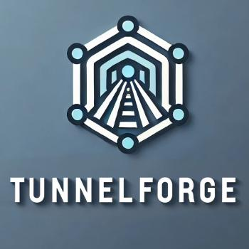

# TunnelForge

**TunnelForge** is a lightweight, open-source, self-hosted alternative to [ngrok](https://ngrok.com/) that provides tunneling services for exposing local applications to the internet. It supports HTTP, WebSocket, and any other TCP-based protocols, allowing seamless integration with modern applications.

## Features

- Expose local services to the internet with unique subdomains.
- Support for HTTP, WebSocket, and other TCP-based protocols.
- Easy setup for local and public servers.
- Support for environment-based configurations.
- Daemonized server processes with PM2.
- DNS configuration support via Cloudflare.
- Future Docker support for containerized deployments.

## Installation

1. Clone the repository:
   ```bash
   git clone https://github.com/elshadaghazade/tunnelforge.git
   cd tunnelforge
   ```
2. Install dependencies:
    ```
    npm install
    ```
3. Build the project:
    ```
    npm run build
    ```

## Usage

### Development Mode
1. Start the **server**:
    ```
    npm run server:dev
    ```
    The server will generate a static subdomain (sub1).
2. Add an entry to your local ```/etc/hosts``` file:
    ```
    127.0.0.1 sub1.myproxy.com
    ```
3. Start the **client**:
    ```
    npm run client:dev -- -h myproxy.com -p [SERVER_PORT_FROM_ENV] -q [LOCAL_APP_PORT] -r [LOCAL_APP_HOST]
    ```
4. Access your application using:
    ```
    http://sub1.myproxy.com:[INCOMING_PORT_FROM_ENV]
    ```

## Production Mode
1. **On the server**:
    - Open ports for ```CLIENT_SERVER_PORT``` and ```INCOMING_SERVER_PORT``` in your cloud environment (e.g., AWS EC2).
    - Configure DNS in Cloudflare:
        - Create an ```A``` record for ```*.yourdomain.com``` pointing to your server's IP.
    - Run the server:
        ```
        npm run server:prod
        ```
    - PM2 users can daemonize the process:
        ```
        pm2 start ecosystem.config.js
        ```
2. On the client:
    - Build the client:
        ```
        npm run build
        ```
    - Run the client:
        ```
        npm run client:prod -- -h yourdomain.com -p [SERVER_PORT_FROM_ENV] -q [LOCAL_APP_PORT] -r [LOCAL_APP_HOST]
        ```
    - After connecting, the client logs the public address:
        ```
        Your public address is http://[UNIQUE_SUBDOMAIN].yourdomain.com:[INCOMING_PORT_FROM_ENV]
        ```
    - Access your public application using the generated public address.

## Environment Variables
Set these variables in your ```.env.development``` or ```.env.production``` file:
```
NODE_ENV=production
CLIENT_SERVER_PORT=4000
INCOMING_SERVER_PORT=4001
SERVER_CLIENT_HOST=0.0.0.0
SERVER_INCOMING_HOST=0.0.0.0
RECONNECT_INTERVAL=1000
PROXY_SERVER_MAIN_HOST=globalmedbooking.com
```

## Docker Support
**Coming soon.**
Stay tuned for Dockerfile and **docker-compose.yml** configurations for containerized deployments.

## Contributing
We welcome contributions! See our [Contributing Guidelines](./CONTRIBUTING.md) for details.

## License
TunnelForge is licensed under the [MIT License](./LICENSE).

## Official Website
Visit the official website of TunnelForge for more details: [tunnelforge.org](https://tunnelforge.org).

## Documentation
The full API and usage documentation is hosted on [GitHub Pages](https://elshadaghazade.github.io/tunnerforge/). 

If you'd like to view it locally or use it in a different hosting platform, the documentation is generated using TypeDoc and is located in the [/docs](./docs/index.html) folder.

Happy tunneling with **TunnelForge!**